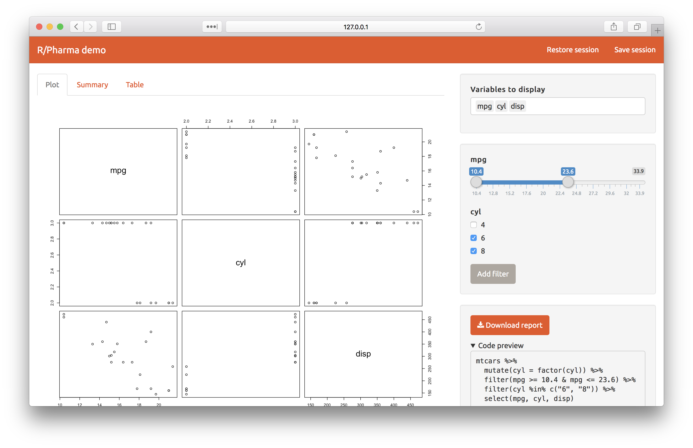
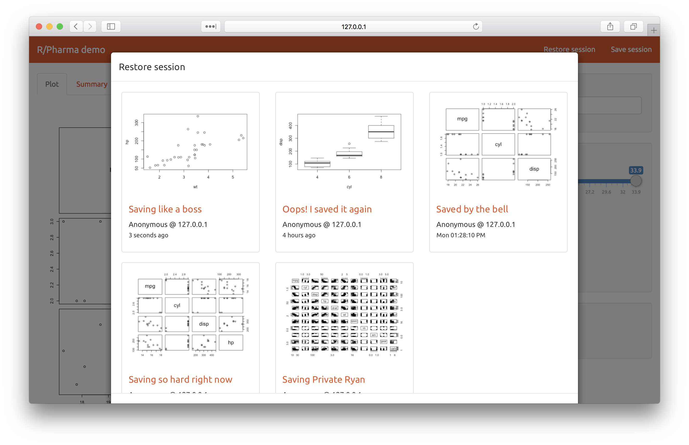

# Shiny demo for R/Pharma 2018

This repo contains an example Shiny app that demonstrates some features that may be particularly useful to pharma:

1. **Select/filter controls:** implemented as Shiny modules
2. **Save/restore sessions:** an alternative front-end to bookmarks
3. **Code generation:** viewing not just manipulated data, but the code used to manipulate the data
4. **Report downloading:** on-demand generation of zip archive containing both PDF and .Rmd

Thank you to Adrian Waddell (Roche), Eric Nantz (Eli Lilly) and Xiao Ni (Novartis) for inspiring this app!




## Installation

This app has a number of CRAN dependencies:

```r
install.packages(c("base64enc", "dplyr", "lubridate",
  "pool", "rmarkdown", "RSQLite", "shinythemes",
  "sourcetools", "stringr", "styler", "yaml"))
```

You can run the app in the usual way, by running `app.R` in RStudio or just `shiny::runApp()` from the repo directory.

## License

[CC0](https://creativecommons.org/share-your-work/public-domain/cc0/)
